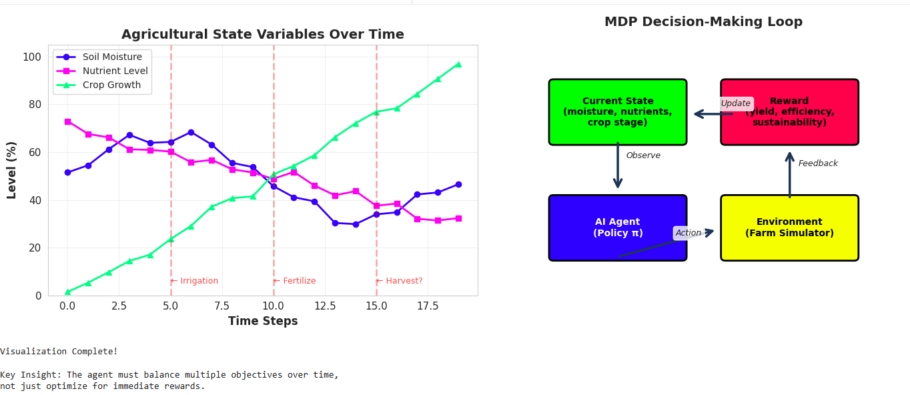
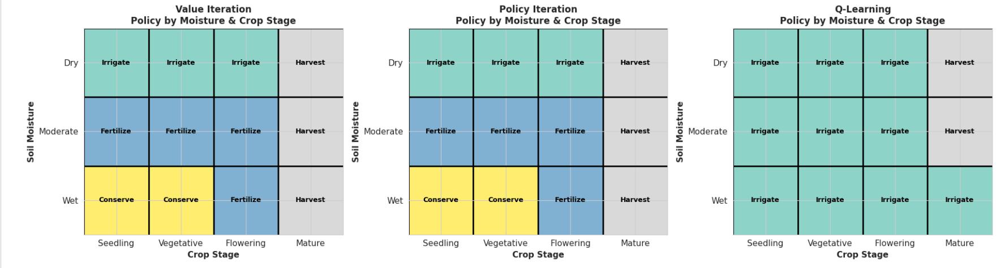
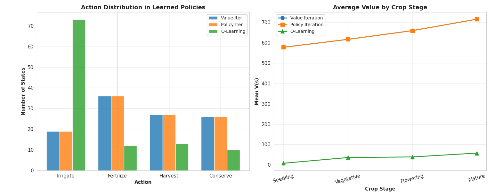
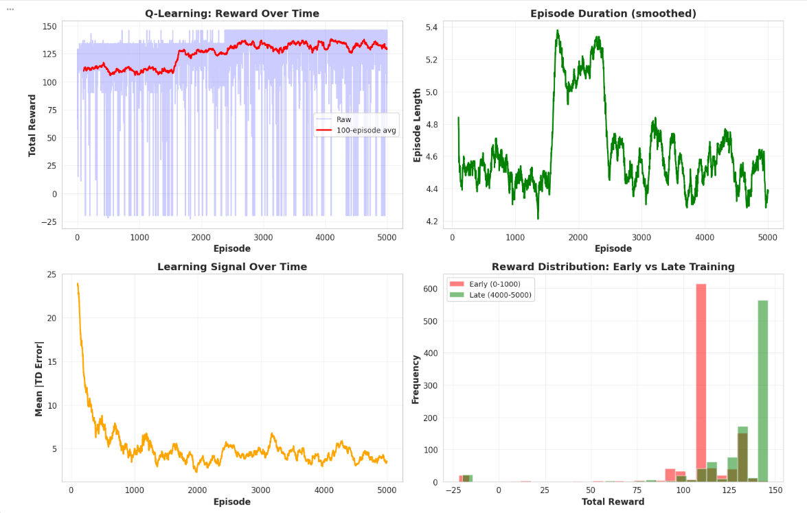
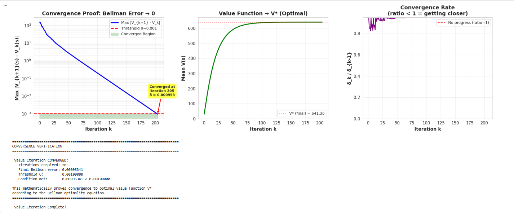
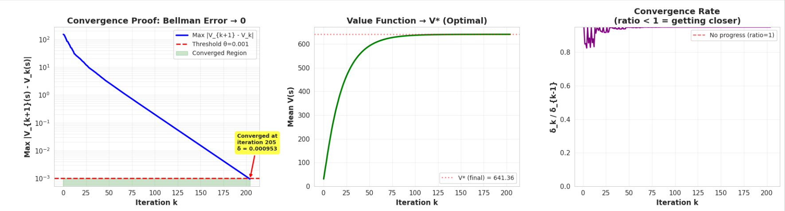
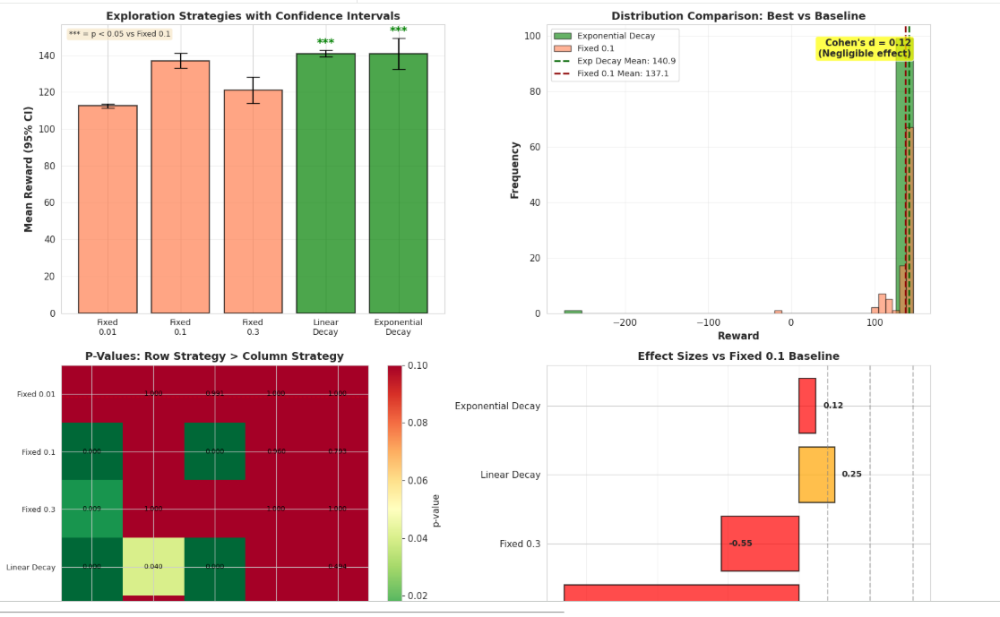
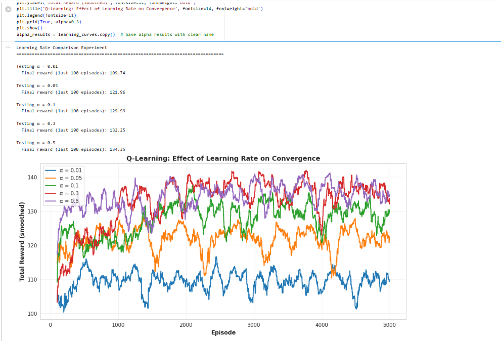
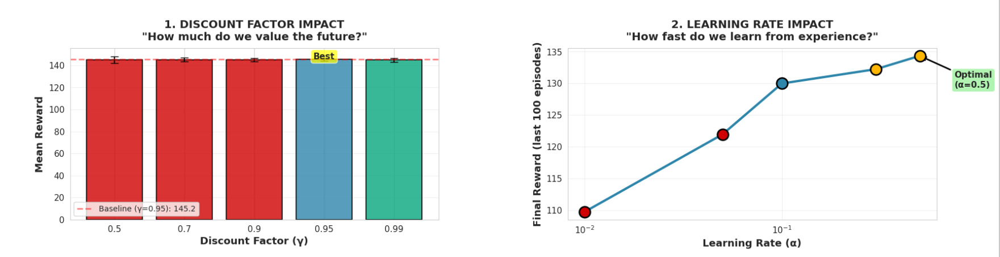
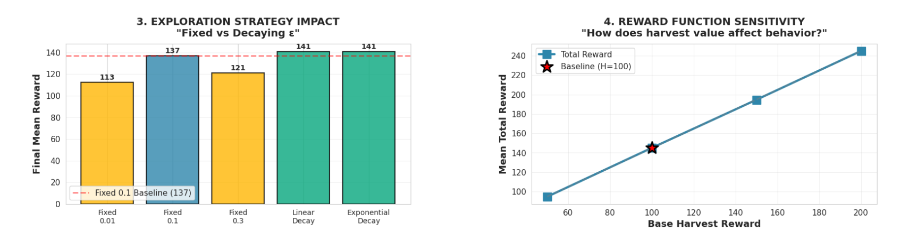

# 🌱 Sustainable Agriculture AI (MDP + Reinforcement Learning)

## 📌 Project Overview

This project builds an AI system for **Sustainable Agriculture and Resource Management** using:

* Markov Decision Processes (MDPs)
* Value Iteration
* Policy Iteration
* Q-Learning (Reinforcement Learning)

The goal is to optimize long-term decisions such as **irrigation, fertilization, harvesting, and conservation** under uncertainty.

---

## 🔍 System Overview

### Agricultural Dynamics + MDP Loop



This diagram shows how the agent observes environmental state (soil moisture, nutrients, crop stage), selects actions, and receives rewards to improve decisions over time.

---

## 🧠 Problem Formulation

* **State Space (108 states)**:

  * Soil moisture (Dry, Moderate, Wet)
  * Crop stage (Seedling → Mature)
  * Nutrient level (3 levels)
  * Water availability (3 levels)

* **Actions**:

  * Irrigate, Fertilize, Harvest, Conserve

* **Objective**:
  Maximize long-term reward balancing productivity and sustainability.

---

## 🤖 Algorithms Implemented

### Value Iteration & Policy Iteration

* Exact MDP solution using Bellman optimality
* Policy Iteration converges faster

### Q-Learning

* Model-free learning from experience
* Uses ε-greedy exploration
* Trained for 5000 episodes

---

## 📊 Algorithm Performance

### Performance Comparison



* Value Iteration and Policy Iteration achieve optimal performance
* Q-Learning performs slightly lower but still strong

---

### Policy Comparison Across Algorithms


* Value & Policy Iteration produce identical policies
* Q-Learning differs in some states due to limited exploration

---

### Action Distribution



* Optimal policies are balanced
* Q-Learning shows bias toward irrigation

---

## 📈 Learning Behavior (Reinforcement Learning)

### Q-Learning Training Dynamics



* Reward improves over episodes
* TD error decreases → learning stabilizes
* Episode length stabilizes → consistent behavior

---

## 📉 Convergence Analysis

### Bellman Convergence Proof



* Value Iteration converges in **205 iterations**
* Bellman error → near zero
* Confirms theoretical correctness

---

### Convergence Comparison



* Policy Iteration converges faster than Value Iteration

---

## ⚙️ Parameter Analysis

### Full Parameter Tuning Dashboard


Covers:

* Discount factor (γ)
* Learning rate (α)
* Exploration strategies
* Reward sensitivity
* Efficiency comparison

---

### Exploration Strategy Analysis



* Decay-based strategies perform best
* Statistical tests validate improvements

---

### Learning Rate Impact



* Higher learning rates improve convergence speed
* Optimal α ≈ 0.5

---

### Discount Factor Impact



* Higher γ improves long-term planning
* Trade-off: slower convergence

---

### Reward Sensitivity



* Higher harvest reward increases total returns
* Demonstrates importance of reward design

---

## 📈 Key Results

| Algorithm        | Mean Reward | Notes                  |
| ---------------- | ----------- | ---------------------- |
| Value Iteration  | ~145        | Optimal                |
| Policy Iteration | ~145        | Faster convergence     |
| Q-Learning       | ~141        | Learns from experience |

---

## 🧠 Key Insights

* Model-based methods achieve **optimal policies**
* Q-Learning learns strong but approximate policies
* Exploration strategy significantly impacts learning
* Reward design strongly influences behavior
* MDPs effectively model long-term decision-making

---

## 🚀 How to Run

```bash
git clone https://github.com/your-username/your-repo-name.git
cd your-repo-name
pip install -r requirements.txt
jupyter notebook project_3_SARM.ipynb
```

---

## 📂 Project Structure

```
project_3_SARM.ipynb
README.md
requirements.txt
images/
```

---

## 🔮 Future Work

* Use real-world agricultural datasets
* Extend to continuous state spaces
* Apply Deep Reinforcement Learning (DQN)
* Integrate weather prediction

---

## 👤 Author

Arya Singh

---

## 📘 Course

COMP 569 – Artificial Intelligence
California State University Channel Islands
